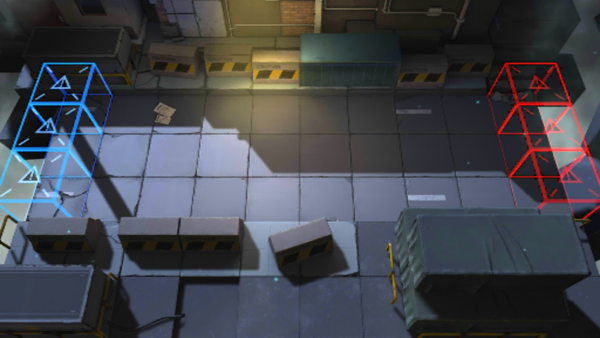

# 关卡一览————CE-4

## 关卡一览

关卡编号: CE-4

关卡名称: 国际重犯押运

目标点生命值: 3

敌人总数: 30

理智消耗: 25

## 关卡地图

## 敌人情况

| 敌人图片 | 敌人名称 | 数量  |
|---------|-----|-----|
| ./eneIcons/eneIcons/·¥Ä¾»ú.png| 伐木机  |   3  |
| ./eneIcons/eneIcons/¿Õ½µ±ø.png| 空降兵  |   3  |
| ./eneIcons/eneIcons/Ê¿±ø.png| 士兵  |   21  |
| ./eneIcons/eneIcons/ÖØ×°·ÀÓù×鳤.png| 重装防御组长  |   3  |
