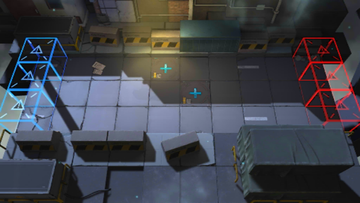

# 关卡一览————CE-5

## 关卡一览

关卡编号: CE-5

关卡名称: 机密情报押运

目标点生命值: 3

敌人总数: 42

理智消耗: 30

## 关卡地图

## 敌人情况

| 敌人图片 | 敌人名称 | 数量  |
|---------|-----|-----|
| ./eneIcons/eneIcons/·¥Ä¾ÀÏÊÖ.png| 伐木老手  |   3  |
| ./eneIcons/eneIcons/·¨Êõ½üÎÀ.png| 法术近卫  |   4  |
| ./eneIcons/eneIcons/·¨Êõ½üÎÀ×鳤.png| 法术近卫组长  |   3  |
| ./eneIcons/eneIcons/Á÷ÀËÕß.png| 流浪者  |   3  |
| ./eneIcons/eneIcons/Çá¼×ÎÀ±ø×鳤.png| 轻甲卫兵组长  |   9  |
| ./eneIcons/eneIcons/ÍÀÔ×ÀÏÊÖ.png| 屠宰老手  |   3  |
| ./eneIcons/eneIcons/Դʯ³æ¡¤¦Â.png| 源石虫·β  |   14  |
| ./eneIcons/eneIcons/ÖØ×°·ÀÓù×鳤.png| 重装防御组长  |   3  |
