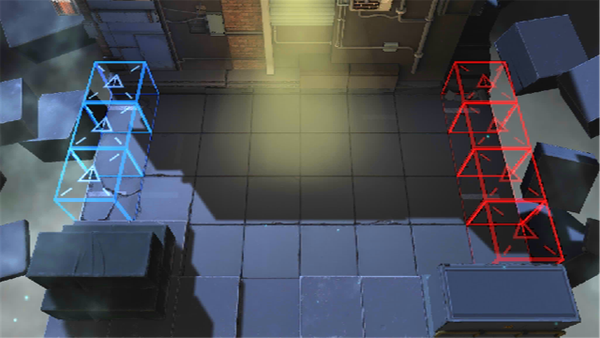

# 关卡一览————CE-6

## 关卡一览

关卡编号: CE-6

关卡名称: 实验原件押运

目标点生命值: 3

敌人总数: 41

理智消耗: 36

## 关卡地图

## 敌人情况

| 敌人图片 | 敌人名称 | 数量  |
|---------|-----|-----|
| ./eneIcons/eneIcons/·ÛËé¹¥¼áÊÖ.png| 粉碎攻坚手  |   4  |
| ./eneIcons/eneIcons/Çá¼×ÎÀ±ø×鳤.png| 轻甲卫兵组长  |   3  |
| ./eneIcons/eneIcons/Èø¿¨×È´ó½£ÊÖ.png| 萨卡兹大剑手  |   10  |
| ./eneIcons/eneIcons/Èø¿¨×È´ó½£×鳤.png| 萨卡兹大剑组长  |   2  |
| ./eneIcons/eneIcons/Õ½ÊõÁÔÈ®pro.png| 战术猎犬pro  |   22  |
