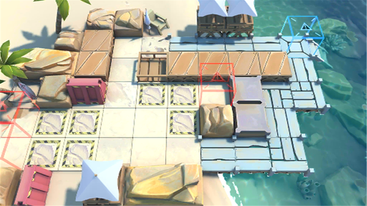

# 关卡一览————DH-2

## 关卡一览

关卡编号: DH-2

关卡名称: 首轮竞赛

目标点生命值: 3

敌人总数: 24

理智消耗: 9

## 关卡地图

## 敌人情况

| 敌人图片 | 敌人名称 | 数量  |
|---------|-----|-----|
| ./eneIcons/eneIcons/²»·¨·Ö×Ó.png| 不法分子  |   15  |
| ./eneIcons/eneIcons/DZˮԱ.png| 潜水员  |   9  |
