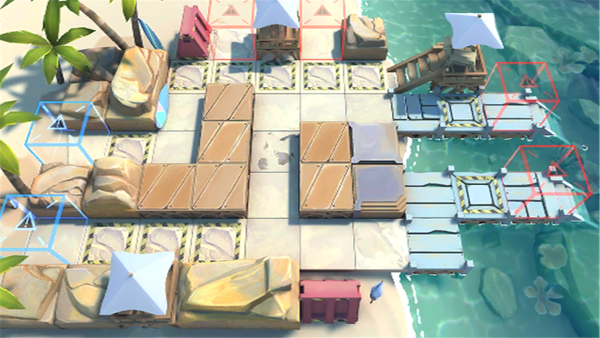

# 关卡一览————DH-3

## 关卡一览

关卡编号: DH-3

关卡名称: 拔铳相助

目标点生命值: 3

敌人总数: 31

理智消耗: 9

## 关卡地图

## 敌人情况

| 敌人图片 | 敌人名称 | 数量  |
|---------|-----|-----|
| ./eneIcons/eneIcons/²»·¨·Ö×Ó.png| 不法分子  |   14  |
| ./eneIcons/eneIcons/ÂëÍ·Ë®ÊÖ.png| 码头水手  |   6  |
| ./eneIcons/eneIcons/DZˮԱ.png| 潜水员  |   11  |
