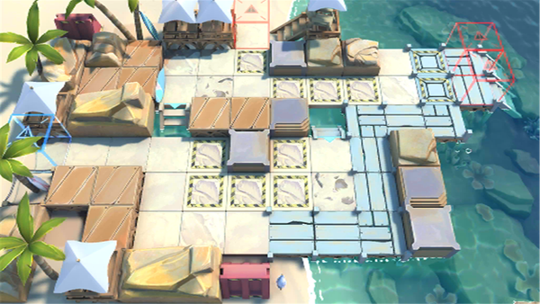

# 关卡一览————DH-4

## 关卡一览

关卡编号: DH-4

关卡名称: 铁人三项

目标点生命值: 3

敌人总数: 30

理智消耗: 12

## 关卡地图

## 敌人情况

| 敌人图片 | 敌人名称 | 数量  |
|---------|-----|-----|
| ./eneIcons/eneIcons/²»·¨·Ö×Ó.png| 不法分子  |   24  |
| ./eneIcons/eneIcons/¿Ø³±Êõʦ.png| 控潮术师  |   4  |
| ./eneIcons/eneIcons/ÂëÍ·Ë®ÊÖ.png| 码头水手  |   2  |
