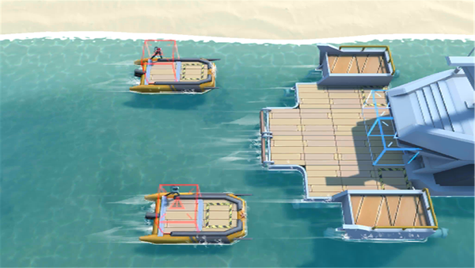

# 关卡一览————DH-8

## 关卡一览

关卡编号: DH-8

关卡名称: 抢滩登陆

目标点生命值: 3

敌人总数: 36

理智消耗: 18

## 关卡地图

## 敌人情况

| 敌人图片 | 敌人名称 | 数量  |
|---------|-----|-----|
| ./eneIcons/eneIcons/´ó½±ÈüÔËÊäͧ.png| 大奖赛运输艇  |   5  |
| ./eneIcons/eneIcons/¿Ø³±Êõʦ.png| 控潮术师  |   0  |
| ./eneIcons/eneIcons/DZˮԱ.png| 潜水员  |   16  |
| ./eneIcons/eneIcons/Êõʦ¿ìͧ.png| 术师快艇  |   3  |
| ./eneIcons/eneIcons/ÎÞÈ˱¬ÆÆͧ.png| 无人爆破艇  |   12  |
