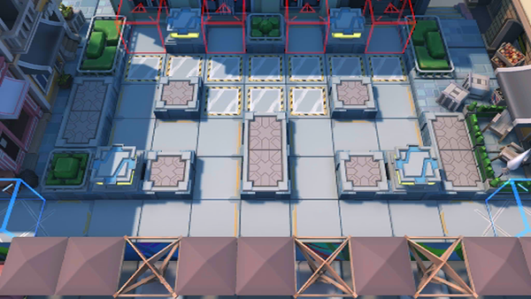

# 关卡一览————DH-EX-1

## 关卡一览

关卡编号: DH-EX-1

关卡名称: 8号商业街

目标点生命值: 3

敌人总数: 42

理智消耗: 10

## 关卡地图

## 敌人情况

| 敌人图片 | 敌人名称 | 数量  |
|---------|-----|-----|
| ./eneIcons/eneIcons/²»·¨·Ö×Ó.png| 不法分子  |   27  |
| ./eneIcons/eneIcons/¿Ø³±Êõʦ.png| 控潮术师  |   2  |
| ./eneIcons/eneIcons/Áì³±Ô±.png| 领潮员  |   1  |
| ./eneIcons/eneIcons/DZˮ¶Ó³¤.png| 潜水队长  |   12  |
