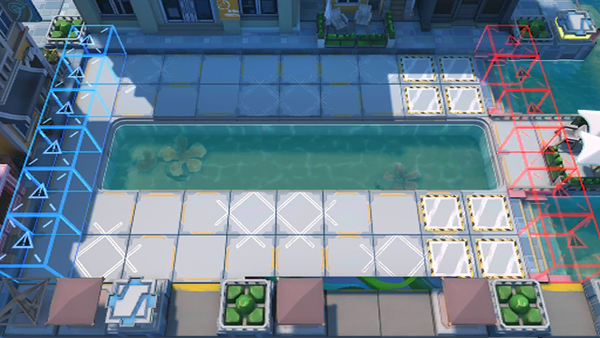

# 关卡一览————DH-EX-4

## 关卡一览

关卡编号: DH-EX-4

关卡名称: 入海口

目标点生命值: 3

敌人总数: 48

理智消耗: 15

## 关卡地图

## 敌人情况

| 敌人图片 | 敌人名称 | 数量  |
|---------|-----|-----|
| ./eneIcons/eneIcons/²»·¨·Ö×ÓÍ·Ä¿.png| 不法分子头目  |   31  |
| ./eneIcons/eneIcons/ÂëÍ·Ë®ÊÖ³¤.png| 码头水手长  |   3  |
| ./eneIcons/eneIcons/DZˮ¶Ó³¤.png| 潜水队长  |   6  |
| ./eneIcons/eneIcons/Ë®ÊÖ³¤ÖØͧ.png| 水手长重艇  |   2  |
| ./eneIcons/eneIcons/ÎÞÈ˱¬ÆÆÖØͧ.png| 无人爆破重艇  |   6  |
