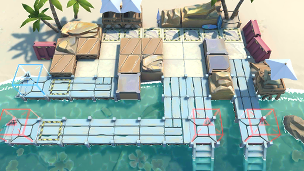

# 关卡一览————DH-EX-5

## 关卡一览

关卡编号: DH-EX-5

关卡名称: 海滨瞭望点

目标点生命值: 3

敌人总数: 33

理智消耗: 15

## 关卡地图

## 敌人情况

| 敌人图片 | 敌人名称 | 数量  |
|---------|-----|-----|
| ./eneIcons/eneIcons/²»·¨·Ö×ÓÍ·Ä¿.png| 不法分子头目  |   5  |
| ./eneIcons/eneIcons/´ó½±ÈüÔËÊäͧ.png| 大奖赛运输艇  |   6  |
| ./eneIcons/eneIcons/Áì³±Ô±.png| 领潮员  |   0  |
| ./eneIcons/eneIcons/Áì³±Ô±¿ìͧ.png| 领潮员快艇  |   3  |
| ./eneIcons/eneIcons/DZˮ¶Ó³¤.png| 潜水队长  |   11  |
| ./eneIcons/eneIcons/ÎÞÈ˱¬ÆÆÖØͧ.png| 无人爆破重艇  |   8  |
