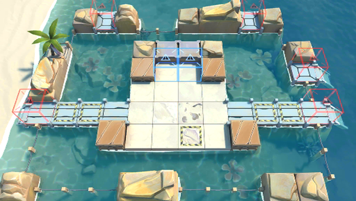

# 关卡一览————DH-EX-8

## 关卡一览

关卡编号: DH-EX-8

关卡名称: 欲擒故纵

目标点生命值: 3

敌人总数: 34

理智消耗: 20

## 关卡地图

## 敌人情况

| 敌人图片 | 敌人名称 | 数量  |
|---------|-----|-----|
| ./eneIcons/eneIcons/²»·¨·Ö×ÓÍ·Ä¿.png| 不法分子头目  |   20  |
| ./eneIcons/eneIcons/Áì³±Ô±.png| 领潮员  |   0  |
| ./eneIcons/eneIcons/Áì³±Ô±¿ìͧ.png| 领潮员快艇  |   3  |
| ./eneIcons/eneIcons/ÂëÍ·Ë®ÊÖ³¤.png| 码头水手长  |   0  |
| ./eneIcons/eneIcons/ÅËÇÇ¡¤ÈøÀ­Ë¹.png| 潘乔·萨拉斯  |   1  |
| ./eneIcons/eneIcons/ÅËÇǵı¬ÆÆͧ.png| 潘乔的爆破艇  |   0  |
| ./eneIcons/eneIcons/DZˮ¶Ó³¤.png| 潜水队长  |   7  |
| ./eneIcons/eneIcons/Ë®ÊÖ³¤ÖØͧ.png| 水手长重艇  |   3  |
