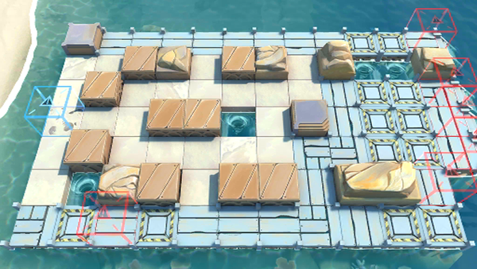

# 关卡一览————DH-MO-1

## 关卡一览

关卡编号: DH-MO-1

关卡名称: 多索雷斯北郊

目标点生命值: 10

敌人总数: 403

理智消耗: 0

## 关卡地图

## 敌人情况

| 敌人图片 | 敌人名称 | 数量  |
|---------|-----|-----|
| ./eneIcons/eneIcons/²»·¨·Ö×Ó.png| 不法分子  |   102  |
| ./eneIcons/eneIcons/²»·¨·Ö×ÓÍ·Ä¿.png| 不法分子头目  |   44  |
| ./eneIcons/eneIcons/´ó½±ÈüÔËÊäͧ.png| 大奖赛运输艇  |   3  |
| ./eneIcons/eneIcons/¿Õ½µ×鳤.png| 空降组长  |   18  |
| ./eneIcons/eneIcons/¿Ø³±Êõʦ.png| 控潮术师  |   6  |
| ./eneIcons/eneIcons/Áì³±Ô±.png| 领潮员  |   1  |
| ./eneIcons/eneIcons/Áì³±Ô±¿ìͧ.png| 领潮员快艇  |   13  |
| ./eneIcons/eneIcons/ÂëÍ·Ë®ÊÖ.png| 码头水手  |   29  |
| ./eneIcons/eneIcons/ÂëÍ·Ë®ÊÖ³¤.png| 码头水手长  |   5  |
| ./eneIcons/eneIcons/DZˮ¶Ó³¤.png| 潜水队长  |   14  |
| ./eneIcons/eneIcons/DZˮԱ.png| 潜水员  |   33  |
| ./eneIcons/eneIcons/Êõʦ¿ìͧ.png| 术师快艇  |   7  |
| ./eneIcons/eneIcons/Ë®ÊÖ³¤ÖØͧ.png| 水手长重艇  |   13  |
| ./eneIcons/eneIcons/Ë®ÊÖÖØͧ.png| 水手重艇  |   5  |
| ./eneIcons/eneIcons/ÎÞÈ˱¬ÆÆͧ.png| 无人爆破艇  |   25  |
| ./eneIcons/eneIcons/ÎÞÈ˱¬ÆÆÖØͧ.png| 无人爆破重艇  |   35  |
| ./eneIcons/eneIcons/Õ½ÊõÁÔÈ®.png| 战术猎犬  |   31  |
| ./eneIcons/eneIcons/Õ½ÊõÁÔÈ®pro.png| 战术猎犬pro  |   19  |
