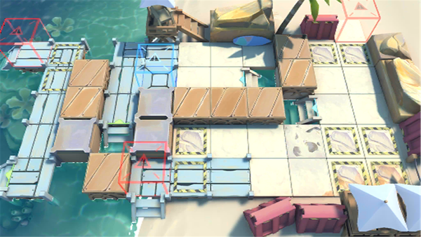

# 关卡一览————DH-S-1

## 关卡一览

关卡编号: DH-S-1

关卡名称: 鬼使神差

目标点生命值: 3

敌人总数: 23

理智消耗: 15

## 关卡地图

## 敌人情况

| 敌人图片 | 敌人名称 | 数量  |
|---------|-----|-----|
| ./eneIcons/eneIcons/²»·¨·Ö×ÓÍ·Ä¿.png| 不法分子头目  |   12  |
| ./eneIcons/eneIcons/Áì³±Ô±.png| 领潮员  |   1  |
| ./eneIcons/eneIcons/Áì³±Ô±¿ìͧ.png| 领潮员快艇  |   3  |
| ./eneIcons/eneIcons/ÂëÍ·Ë®ÊÖ³¤.png| 码头水手长  |   3  |
| ./eneIcons/eneIcons/Ë®ÊÖ³¤ÖØͧ.png| 水手长重艇  |   4  |
