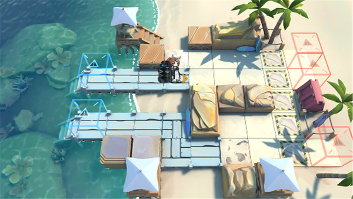

# 关卡一览————DH-TR-1

## 关卡一览

关卡编号: DH-TR-1

关卡名称: 初来乍到

目标点生命值: 15

敌人总数: 13

理智消耗: 0

## 关卡地图

## 敌人情况

| 敌人图片 | 敌人名称 | 数量  |
|---------|-----|-----|
| ./eneIcons/eneIcons/²»·¨·Ö×Ó.png| 不法分子  |   9  |
| ./eneIcons/eneIcons/Õ½ÊõÁÔÈ®.png| 战术猎犬  |   4  |
