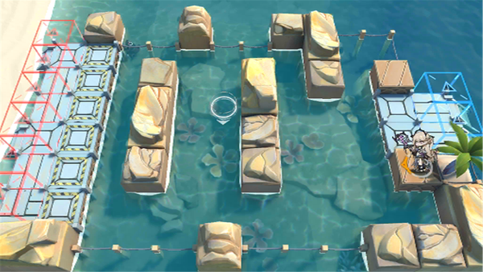

# 关卡一览————DH-TR-2

## 关卡一览

关卡编号: DH-TR-2

关卡名称: 插翅难飞

目标点生命值: 5

敌人总数: 5

理智消耗: 0

## 关卡地图

## 敌人情况

| 敌人图片 | 敌人名称 | 数量  |
|---------|-----|-----|
| ./eneIcons/eneIcons/ÂëÍ·Ë®ÊÖ.png| 码头水手  |   2  |
| ./eneIcons/eneIcons/Ë®ÊÖÖØͧ.png| 水手重艇  |   3  |
