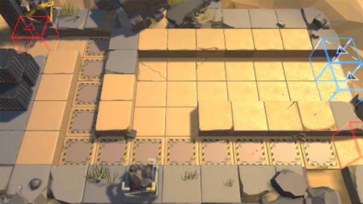

# 关卡一览————DM-1

## 关卡一览

关卡编号: DM-1

关卡名称: 埋藏

目标点生命值: 5

敌人总数: 44

理智消耗: 9

## 关卡地图

## 敌人情况

| 敌人图片 | 敌人名称 | 数量  |
|---------|-----|-----|
| ./eneIcons/eneIcons/ÁÔ¹·pro.png| 猎狗pro  |   12  |
| ./eneIcons/eneIcons/Èø¿¨×ȵ¶±ø.png| 萨卡兹刀兵  |   8  |
| ./eneIcons/eneIcons/ËáҺԴʯ³æ.png| 酸液源石虫  |   8  |
| ./eneIcons/eneIcons/Դʯ³æ¡¤¦Â.png| 源石虫·β  |   16  |
