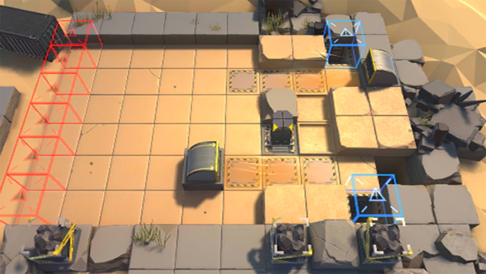

# 关卡一览————DM-3

## 关卡一览

关卡编号: DM-3

关卡名称: 挤压

目标点生命值: 3

敌人总数: 32

理智消耗: 12

## 关卡地图

## 敌人情况

| 敌人图片 | 敌人名称 | 数量  |
|---------|-----|-----|
| ./eneIcons/eneIcons/»ú¶¯ÎÀ±ø.png| 机动卫兵  |   4  |
| ./eneIcons/eneIcons/ÁÔ¹·pro.png| 猎狗pro  |   7  |
| ./eneIcons/eneIcons/Èø¿¨×È´©´ÌÊÖ.png| 萨卡兹穿刺手  |   8  |
| ./eneIcons/eneIcons/Èø¿¨×ȵ¶±ø.png| 萨卡兹刀兵  |   13  |
