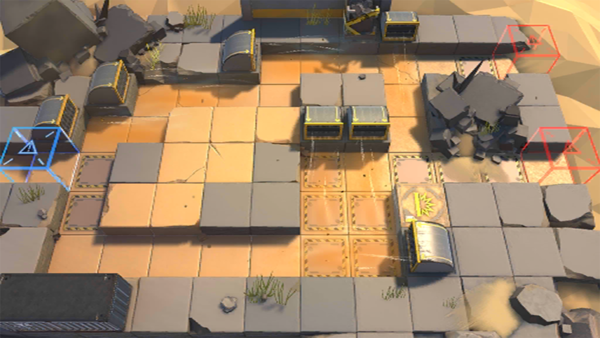

# 关卡一览————DM-5

## 关卡一览

关卡编号: DM-5

关卡名称: 旗帜

目标点生命值: 3

敌人总数: 33

理智消耗: 15

## 关卡地图

## 敌人情况

| 敌人图片 | 敌人名称 | 数量  |
|---------|-----|-----|
| ./eneIcons/eneIcons/ÁÔ¹·pro.png| 猎狗pro  |   10  |
| ./eneIcons/eneIcons/Èø¿¨×ȵ¶±ø.png| 萨卡兹刀兵  |   14  |
| ./eneIcons/eneIcons/Èø¿¨×Èħ½£Ê¿.png| 萨卡兹魔剑士  |   6  |
| ./eneIcons/eneIcons/Èø¿¨×ÈÉÚ±ø.png| 萨卡兹哨兵  |   3  |
