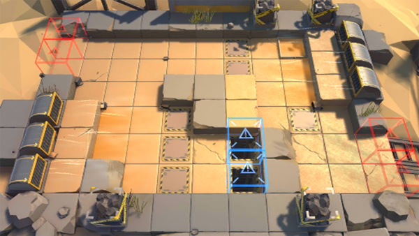

# 关卡一览————DM-8

## 关卡一览

关卡编号: DM-8

关卡名称: 离散

目标点生命值: 3

敌人总数: 44

理智消耗: 18

## 关卡地图

## 敌人情况

| 敌人图片 | 敌人名称 | 数量  |
|---------|-----|-----|
| ./eneIcons/eneIcons/±¬Æƹ¥¼áÊÖ.png| 爆破攻坚手  |   1  |
| ./eneIcons/eneIcons/Çá¼×ÎÀ±ø.png| 轻甲卫兵  |   12  |
| ./eneIcons/eneIcons/Èø¿¨×È´ó½£ÊÖ.png| 萨卡兹大剑手  |   3  |
| ./eneIcons/eneIcons/Èø¿¨×ȵ¶±ø.png| 萨卡兹刀兵  |   18  |
| ./eneIcons/eneIcons/Èø¿¨×È»ýÔ¹Õß.png| 萨卡兹积怨者  |   2  |
| ./eneIcons/eneIcons/Èø¿¨×Èħ½£Ê¿.png| 萨卡兹魔剑士  |   4  |
| ./eneIcons/eneIcons/Èø¿¨×ÈÉÚ±ø.png| 萨卡兹哨兵  |   2  |
| ./eneIcons/eneIcons/ÖØ×°·ÀÓù×鳤.png| 重装防御组长  |   2  |
