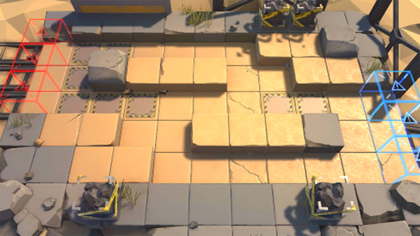

# 关卡一览————DM-EX-1

## 关卡一览

关卡编号: DM-EX-1

关卡名称: 交锋

目标点生命值: 3

敌人总数: 33

理智消耗: 10

## 关卡地图

## 敌人情况

| 敌人图片 | 敌人名称 | 数量  |
|---------|-----|-----|
| ./eneIcons/eneIcons/Èø¿¨×È°Ù·ò³¤.png| 萨卡兹百夫长  |   1  |
| ./eneIcons/eneIcons/Èø¿¨×È´©´ÌÊÖ.png| 萨卡兹穿刺手  |   5  |
| ./eneIcons/eneIcons/Èø¿¨×ȵ¶Êõʦ.png| 萨卡兹刀术师  |   19  |
| ./eneIcons/eneIcons/Èø¿¨×Ⱦѻ÷ÊÖ.png| 萨卡兹狙击手  |   4  |
| ./eneIcons/eneIcons/Èø¿¨×ÈÊõʦ.png| 萨卡兹术师  |   4  |
