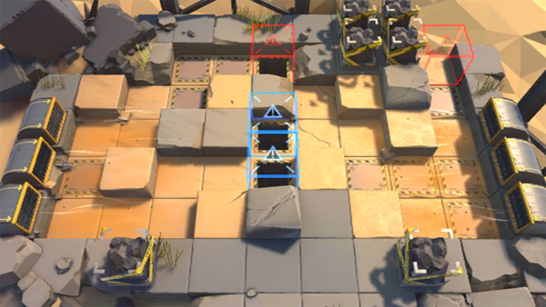

# 关卡一览————DM-EX-2

## 关卡一览

关卡编号: DM-EX-2

关卡名称: 爆破

目标点生命值: 3

敌人总数: 45

理智消耗: 10

## 关卡地图

## 敌人情况

| 敌人图片 | 敌人名称 | 数量  |
|---------|-----|-----|
| ./eneIcons/eneIcons/±¬Æƹ¥¼áÊÖ.png| 爆破攻坚手  |   1  |
| ./eneIcons/eneIcons/±àÖÆÊõʦ×鳤.png| 编制术师组长  |   5  |
| ./eneIcons/eneIcons/Èø¿¨×È°Ù·ò³¤.png| 萨卡兹百夫长  |   1  |
| ./eneIcons/eneIcons/Èø¿¨×È´©´ÌÊÖ×鳤.png| 萨卡兹穿刺手组长  |   8  |
| ./eneIcons/eneIcons/Èø¿¨×È´ó½£ÊÖ.png| 萨卡兹大剑手  |   4  |
| ./eneIcons/eneIcons/Èø¿¨×ȵ¶±ø.png| 萨卡兹刀兵  |   16  |
| ./eneIcons/eneIcons/Èø¿¨×ȵ¶Êõʦ.png| 萨卡兹刀术师  |   10  |
