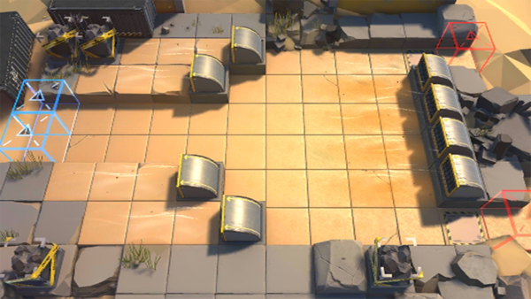

# 关卡一览————DM-EX-3

## 关卡一览

关卡编号: DM-EX-3

关卡名称: 突进

目标点生命值: 3

敌人总数: 32

理智消耗: 15

## 关卡地图

## 敌人情况

| 敌人图片 | 敌人名称 | 数量  |
|---------|-----|-----|
| ./eneIcons/eneIcons/Èø¿¨×È´©´ÌÊÖ.png| 萨卡兹穿刺手  |   5  |
| ./eneIcons/eneIcons/Èø¿¨×È´©´ÌÊÖ×鳤.png| 萨卡兹穿刺手组长  |   4  |
| ./eneIcons/eneIcons/Èø¿¨×È´ó½£ÊÖ.png| 萨卡兹大剑手  |   10  |
| ./eneIcons/eneIcons/Èø¿¨×ȵ¶Êõʦ.png| 萨卡兹刀术师  |   6  |
| ./eneIcons/eneIcons/Èø¿¨×Ⱦѻ÷ÊÖ.png| 萨卡兹狙击手  |   3  |
| ./eneIcons/eneIcons/Èø¿¨×ÈÉÚ±ø×鳤.png| 萨卡兹哨兵组长  |   4  |
