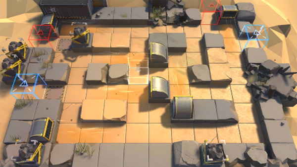

# 关卡一览————DM-EX-4

## 关卡一览

关卡编号: DM-EX-4

关卡名称: 裁判

目标点生命值: 3

敌人总数: 52

理智消耗: 15

## 关卡地图

## 敌人情况

| 敌人图片 | 敌人名称 | 数量  |
|---------|-----|-----|
| ./eneIcons/eneIcons/±¬Æƹ¥¼áÊÖ×鳤.png| 爆破攻坚手组长  |   2  |
| ./eneIcons/eneIcons/Çá¼×ÎÀ±ø×鳤.png| 轻甲卫兵组长  |   7  |
| ./eneIcons/eneIcons/Èø¿¨×È´©´ÌÊÖ×鳤.png| 萨卡兹穿刺手组长  |   18  |
| ./eneIcons/eneIcons/Èø¿¨×ȵ¶Êõʦ.png| 萨卡兹刀术师  |   6  |
| ./eneIcons/eneIcons/ÓÄÁé×鳤.png| 幽灵组长  |   17  |
| ./eneIcons/eneIcons/ÖØ×°·ÀÓù×鳤.png| 重装防御组长  |   2  |
