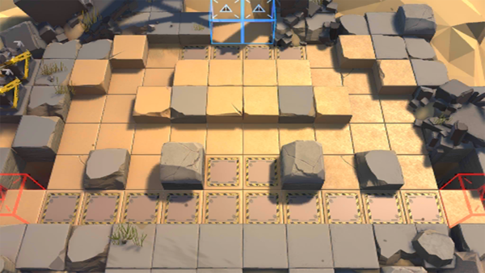

# 关卡一览————DM-EX-5

## 关卡一览

关卡编号: DM-EX-5

关卡名称: 备战

目标点生命值: 3

敌人总数: 39

理智消耗: 20

## 关卡地图

## 敌人情况

| 敌人图片 | 敌人名称 | 数量  |
|---------|-----|-----|
| ./eneIcons/eneIcons/¿ñ±©µÄÁÔ¹·pro.png| 狂暴的猎狗pro  |   10  |
| ./eneIcons/eneIcons/Èø¿¨×ȵ¶Êõʦ.png| 萨卡兹刀术师  |   14  |
| ./eneIcons/eneIcons/Èø¿¨×Èħ½£Ê¿×鳤.png| 萨卡兹魔剑士组长  |   2  |
| ./eneIcons/eneIcons/Èø¿¨×ÈÉÚ±ø×鳤.png| 萨卡兹哨兵组长  |   1  |
