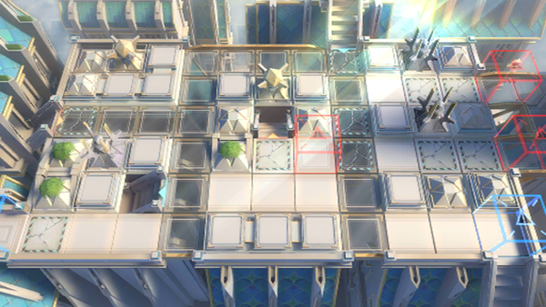

# 关卡一览————GA-EX-8

## 关卡一览

关卡编号: GA-EX-8

关卡名称: 千层蛋糕

目标点生命值: 3

敌人总数: 40

理智消耗: 20

## 关卡地图

## 敌人情况

| 敌人图片 | 敌人名称 | 数量  |
|---------|-----|-----|
| ./eneIcons/eneIcons/¡°Ñ³µÀÕß¡±£¬°²¶à¶÷.png| “殉道者”，安多恩  |   1  |
| ./eneIcons/eneIcons/¾«ÖÂÌǹû³µ.png| 精致糖果车  |   12  |
| ./eneIcons/eneIcons/Íò¹úÐÅʹ£¬°ÂÂ×.png| 万国信使，奥伦  |   1  |
| ./eneIcons/eneIcons/Ѱ·Õß¾«Èñ¾Ñ»÷ÊÖ.png| 寻路者精锐狙击手  |   5  |
| ./eneIcons/eneIcons/Ѱ·Õß¾«Èñսʿ.png| 寻路者精锐战士  |   16  |
| ./eneIcons/eneIcons/Ѱ·ÕßÆæ±ø.png| 寻路者奇兵  |   2  |
| ./eneIcons/eneIcons/Ѱ·ÕßÖªÃûÌðÆ·ÉÌ.png| 寻路者知名甜品商  |   3  |
