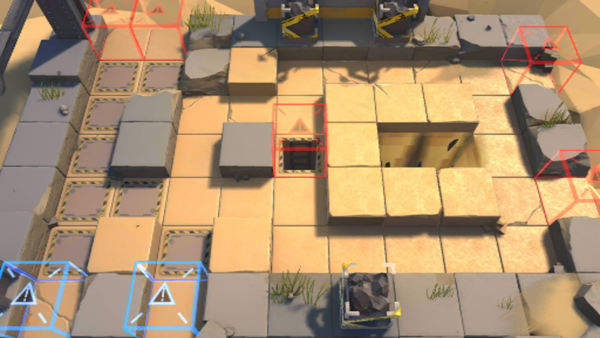

# 关卡一览————GT-3

## 关卡一览

关卡编号: GT-3

关卡名称: 意外之旅

目标点生命值: 5

敌人总数: 67

理智消耗: 12

## 关卡地图

## 敌人情况

| 敌人图片 | 敌人名称 | 数量  |
|---------|-----|-----|
| ./eneIcons/eneIcons/±©ÂÒ·Ö×Ó.png| 暴乱分子  |   15  |
| ./eneIcons/eneIcons/±©Í½.png| 暴徒  |   40  |
| ./eneIcons/eneIcons/·¥Ä¾»ú.png| 伐木机  |   7  |
| ./eneIcons/eneIcons/ȼÉÕƿͶÖÀÕß.png| 燃烧瓶投掷者  |   5  |
