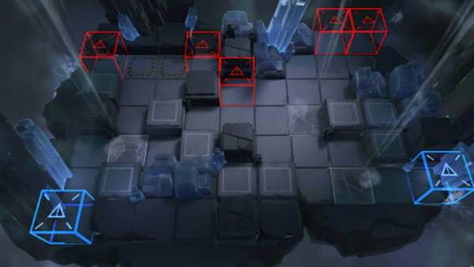

# 关卡一览————GT-4

## 关卡一览

关卡编号: GT-4

关卡名称: 污点证人

目标点生命值: 5

敌人总数: 69

理智消耗: 12

## 关卡地图

## 敌人情况

| 敌人图片 | 敌人名称 | 数量  |
|---------|-----|-----|
| ./eneIcons/eneIcons/±©ÂÒ·Ö×Ó.png| 暴乱分子  |   12  |
| ./eneIcons/eneIcons/±©Í½.png| 暴徒  |   7  |
| ./eneIcons/eneIcons/·¥Ä¾»ú.png| 伐木机  |   3  |
| ./eneIcons/eneIcons/ÁÔ¹·.png| 猎狗  |   19  |
| ./eneIcons/eneIcons/åóÊÖ×鳤.png| 弩手组长  |   5  |
| ./eneIcons/eneIcons/ËáҺԴʯ³æ.png| 酸液源石虫  |   7  |
| ./eneIcons/eneIcons/Դʯ³æ¡¤¦Á.png| 源石虫·α  |   16  |
