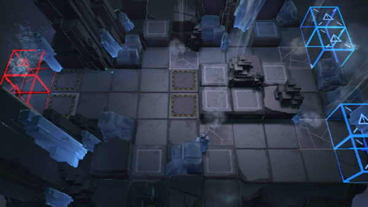

# 关卡一览————GT-5

## 关卡一览

关卡编号: GT-5

关卡名称: 各抒己见

目标点生命值: 3

敌人总数: 80

理智消耗: 15

## 关卡地图

## 敌人情况

| 敌人图片 | 敌人名称 | 数量  |
|---------|-----|-----|
| ./eneIcons/eneIcons/»ú¶¯¶Ü±ø.png| 机动盾兵  |   13  |
| ./eneIcons/eneIcons/¿ñ±©µÄÁÔ¹·pro.png| 狂暴的猎狗pro  |   27  |
| ./eneIcons/eneIcons/ËáҺԴʯ³æ.png| 酸液源石虫  |   25  |
| ./eneIcons/eneIcons/Ñý¹Ö.png| 妖怪  |   7  |
| ./eneIcons/eneIcons/Դʯ³æ¡¤¦Á.png| 源石虫·α  |   8  |
