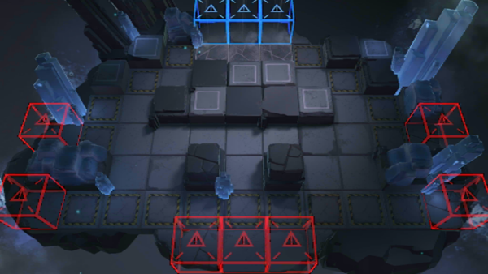

# 关卡一览————GT-6

## 关卡一览

关卡编号: GT-6

关卡名称: 黄金三角

目标点生命值: 3

敌人总数: 97

理智消耗: 15

## 关卡地图

## 敌人情况

| 敌人图片 | 敌人名称 | 数量  |
|---------|-----|-----|
| ./eneIcons/eneIcons/´ó±«²ª.png| 大鲍勃  |   1  |
| ./eneIcons/eneIcons/¿ñ±©µÄÁÔ¹·pro.png| 狂暴的猎狗pro  |   32  |
| ./eneIcons/eneIcons/ÁÔ¹·.png| 猎狗  |   33  |
| ./eneIcons/eneIcons/åóÊÖ×鳤.png| 弩手组长  |   13  |
| ./eneIcons/eneIcons/ÓÄÁé.png| 幽灵  |   18  |
