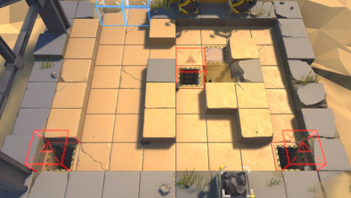

# 关卡一览————GT-EX-2

## 关卡一览

关卡编号: GT-EX-2

关卡名称: 老无所依

目标点生命值: 3

敌人总数: 57

理智消耗: 15

## 关卡地图

## 敌人情况

| 敌人图片 | 敌人名称 | 数量  |
|---------|-----|-----|
| ./eneIcons/eneIcons/±©Í½.png| 暴徒  |   7  |
| ./eneIcons/eneIcons/·¥Ä¾»ú.png| 伐木机  |   1  |
| ./eneIcons/eneIcons/»ú¶¯¶Ü×鳤.png| 机动盾组长  |   10  |
| ./eneIcons/eneIcons/åóÊÖ×鳤.png| 弩手组长  |   7  |
| ./eneIcons/eneIcons/ËáҺԴʯ³æ.png| 酸液源石虫  |   23  |
| ./eneIcons/eneIcons/Դʯ³æ¡¤¦Â.png| 源石虫·β  |   9  |
