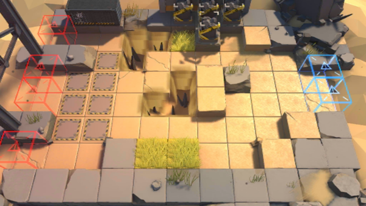

# 关卡一览————GT-EX-3

## 关卡一览

关卡编号: GT-EX-3

关卡名称: 与狼共舞

目标点生命值: 3

敌人总数: 63

理智消耗: 15

## 关卡地图

## 敌人情况

| 敌人图片 | 敌人名称 | 数量  |
|---------|-----|-----|
| ./eneIcons/eneIcons/·¥Ä¾»ú.png| 伐木机  |   4  |
| ./eneIcons/eneIcons/»ú¶¯¶Ü±ø.png| 机动盾兵  |   8  |
| ./eneIcons/eneIcons/»ú¶¯¶Ü×鳤.png| 机动盾组长  |   2  |
| ./eneIcons/eneIcons/¿ñ±©µÄÁÔ¹·pro.png| 狂暴的猎狗pro  |   5  |
| ./eneIcons/eneIcons/ÁÔ¹·pro.png| 猎狗pro  |   23  |
| ./eneIcons/eneIcons/åóÊÖ×鳤.png| 弩手组长  |   4  |
| ./eneIcons/eneIcons/ȼÉÕƿͶÖÀÕß.png| 燃烧瓶投掷者  |   4  |
| ./eneIcons/eneIcons/Ê¿±ø.png| 士兵  |   3  |
| ./eneIcons/eneIcons/Ë«³Ö½£Ê¿.png| 双持剑士  |   8  |
| ./eneIcons/eneIcons/ÖØ×°·ÀÓù×鳤.png| 重装防御组长  |   2  |
