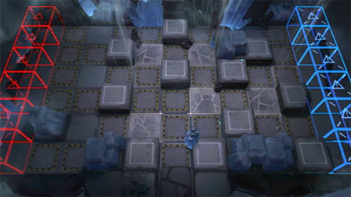

# 关卡一览————GT-HX-1

## 关卡一览

关卡编号: GT-HX-1

关卡名称: 碧血金沙

目标点生命值: 3

敌人总数: 100

理智消耗: 15

## 关卡地图

## 敌人情况

| 敌人图片 | 敌人名称 | 数量  |
|---------|-----|-----|
| ./eneIcons/eneIcons/¿ñ±©µÄÁÔ¹·pro.png| 狂暴的猎狗pro  |   12  |
| ./eneIcons/eneIcons/ÁÔ¹·pro.png| 猎狗pro  |   13  |
| ./eneIcons/eneIcons/Ê¿±ø.png| 士兵  |   21  |
| ./eneIcons/eneIcons/ËáҺԴʯ³æ.png| 酸液源石虫  |   12  |
| ./eneIcons/eneIcons/Դʯ³æ¡¤¦Á.png| 源石虫·α  |   20  |
| ./eneIcons/eneIcons/Դʯ³æ¡¤¦Â.png| 源石虫·β  |   22  |
