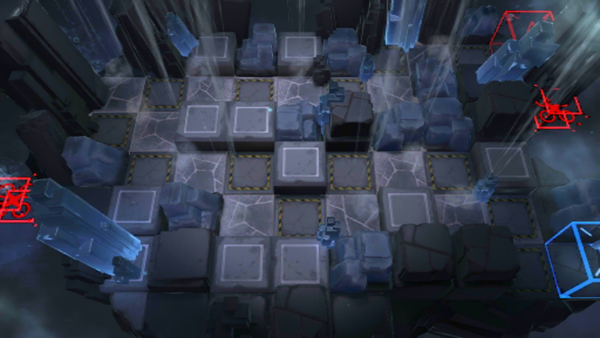

# 关卡一览————GT-HX-2

## 关卡一览

关卡编号: GT-HX-2

关卡名称: 关山飞渡

目标点生命值: 3

敌人总数: 48

理智消耗: 15

## 关卡地图

## 敌人情况

| 敌人图片 | 敌人名称 | 数量  |
|---------|-----|-----|
| ./eneIcons/eneIcons/´óÑǵ±.png| 大亚当  |   1  |
| ./eneIcons/eneIcons/¿ñ±©µÄÁÔ¹·pro.png| 狂暴的猎狗pro  |   9  |
| ./eneIcons/eneIcons/È­ÈÐÎäÊ¿×鳤.png| 拳刃武士组长  |   6  |
| ./eneIcons/eneIcons/ȼÉÕƿͶÖÀÕß.png| 燃烧瓶投掷者  |   2  |
| ./eneIcons/eneIcons/Ê¿±ø.png| 士兵  |   19  |
| ./eneIcons/eneIcons/Ñý¹ÖMKII.png| 妖怪MKII  |   4  |
| ./eneIcons/eneIcons/ÓÄÁé×鳤.png| 幽灵组长  |   7  |
