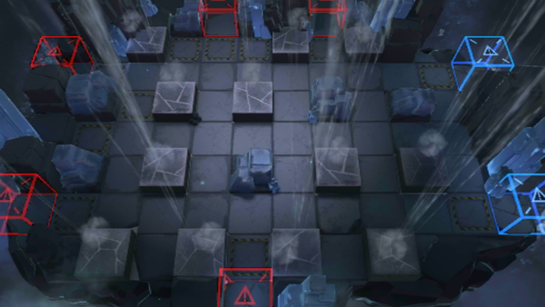

# 关卡一览————GT-HX-3

## 关卡一览

关卡编号: GT-HX-3

关卡名称: 西部往事

目标点生命值: 3

敌人总数: 92

理智消耗: 15

## 关卡地图

## 敌人情况

| 敌人图片 | 敌人名称 | 数量  |
|---------|-----|-----|
| ./eneIcons/eneIcons/´óÑǵ±.png| 大亚当  |   1  |
| ./eneIcons/eneIcons/åóÊÖ.png| 弩手  |   3  |
| ./eneIcons/eneIcons/åóÊÖ×鳤.png| 弩手组长  |   7  |
| ./eneIcons/eneIcons/Çá¼×ÎÀ±ø×鳤.png| 轻甲卫兵组长  |   24  |
| ./eneIcons/eneIcons/Ë«³Ö½£Ê¿.png| 双持剑士  |   24  |
| ./eneIcons/eneIcons/Ë«³Ö½£Ê¿×鳤.png| 双持剑士组长  |   32  |
| ./eneIcons/eneIcons/ÖØ×°ÎåÊ®·ò³¤.png| 重装五十夫长  |   1  |
