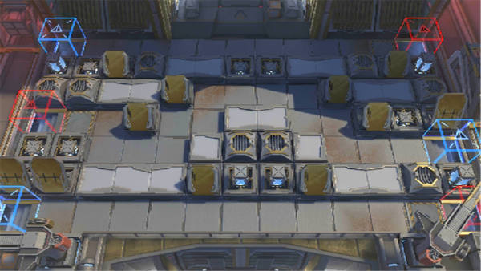

# 关卡一览————H10-1

## 关卡一览

关卡编号: H10-1

关卡名称: 日晕行动-1

目标点生命值: 3

敌人总数: 52

理智消耗: 10

## 关卡地图

## 敌人情况

| 敌人图片 | 敌人名称 | 数量  |
|---------|-----|-----|
| ./eneIcons/eneIcons/±¥¸¹µÄ×ÓÒá.png| 饱腹的子裔  |   14  |
| ./eneIcons/eneIcons/¿¶¿®Ö®´Í.png| 慷慨之赐  |   11  |
| ./eneIcons/eneIcons/Âü¸¥À×µÂ.png| 曼弗雷德  |   1  |
| ./eneIcons/eneIcons/ÈÊ´ÈÖ®´¥.png| 仁慈之触  |   0  |
| ./eneIcons/eneIcons/Èø¿¨×È×ÓÒá¸Ä×°²¹¸ø³µ.png| 萨卡兹子裔改装补给车  |   5  |
| ./eneIcons/eneIcons/Èø¿¨×È×ÓÒáÁ´Êõʦ×鳤.png| 萨卡兹子裔链术师组长  |   5  |
| ./eneIcons/eneIcons/Èø¿¨×È×ÓÒáսʿ×鳤.png| 萨卡兹子裔战士组长  |   16  |
