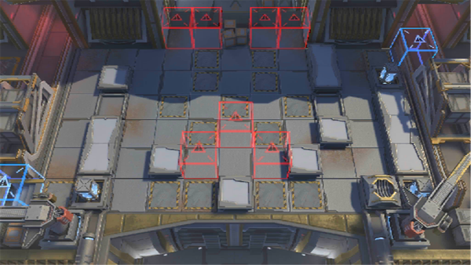

# 关卡一览————H10-3

## 关卡一览

关卡编号: H10-3

关卡名称: 日晕行动-3

目标点生命值: 3

敌人总数: 114

理智消耗: 10

## 关卡地图

## 敌人情况

| 敌人图片 | 敌人名称 | 数量  |
|---------|-----|-----|
| ./eneIcons/eneIcons/¿¶¿®Ö®´Í.png| 慷慨之赐  |   13  |
| ./eneIcons/eneIcons/Âü¸¥À×µÂ.png| 曼弗雷德  |   1  |
| ./eneIcons/eneIcons/ÈÊ´ÈÖ®´¥.png| 仁慈之触  |   61  |
| ./eneIcons/eneIcons/Èø¿¨×È×ÓÒá¸Ä×°²¹¸ø³µ.png| 萨卡兹子裔改装补给车  |   3  |
| ./eneIcons/eneIcons/Èø¿¨×È×ÓÒṤ½³×鳤.png| 萨卡兹子裔工匠组长  |   4  |
| ./eneIcons/eneIcons/Èø¿¨×È×ÓÒἯŭÕß.png| 萨卡兹子裔集怒者  |   8  |
| ./eneIcons/eneIcons/Èø¿¨×È×ÓÒáսʿ×鳤.png| 萨卡兹子裔战士组长  |   24  |
