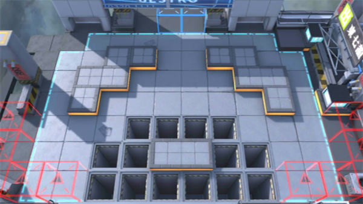

# 关卡一览————H5-2

## 关卡一览

关卡编号: H5-2

关卡名称: 炼狱行动-2

目标点生命值: 3

敌人总数: 89

理智消耗: 10

## 关卡地图

## 敌人情况

| 敌人图片 | 敌人名称 | 数量  |
|---------|-----|-----|
| ./eneIcons/eneIcons/·¥Ä¾ÀÏÊÖ.png| 伐木老手  |   3  |
| ./eneIcons/eneIcons/·¨Êõ½üÎÀ×鳤.png| 法术近卫组长  |   11  |
| ./eneIcons/eneIcons/»¤¶Ü¸ß½×Êõʦ.png| 护盾高阶术师  |   2  |
| ./eneIcons/eneIcons/Çá¼×ÎÀ±ø×鳤.png| 轻甲卫兵组长  |   20  |
| ./eneIcons/eneIcons/Ë«³Ö½£Ê¿×鳤.png| 双持剑士组长  |   12  |
| ./eneIcons/eneIcons/ÌØսʿ±ø.png| 特战士兵  |   15  |
| ./eneIcons/eneIcons/ÌØÕ½Êõʦ.png| 特战术师  |   18  |
| ./eneIcons/eneIcons/ÌØÕ½Êõʦ×鳤.png| 特战术师组长  |   6  |
| ./eneIcons/eneIcons/ÖØ×°·ÀÓù×鳤.png| 重装防御组长  |   2  |
