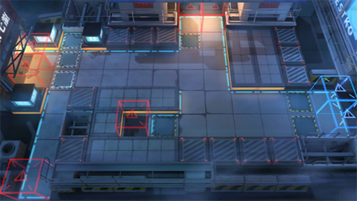

# 关卡一览————H5-4

## 关卡一览

关卡编号: H5-4

关卡名称: 炼狱行动-4

目标点生命值: 3

敌人总数: 89

理智消耗: 10

## 关卡地图

## 敌人情况

| 敌人图片 | 敌人名称 | 数量  |
|---------|-----|-----|
| ./eneIcons/eneIcons/·¨Êõ´óʦA1.png| 法术大师A1  |   8  |
| ./eneIcons/eneIcons/·¨Êõ½üÎÀ.png| 法术近卫  |   23  |
| ./eneIcons/eneIcons/¸¡Ê¿µÂ.png| 浮士德  |   1  |
| ./eneIcons/eneIcons/¿ñ±©µÄÁÔ¹·pro.png| 狂暴的猎狗pro  |   9  |
| ./eneIcons/eneIcons/ÅÚ»÷×鳤.png| 炮击组长  |   2  |
| ./eneIcons/eneIcons/Èø¿¨×È´ó½£ÊÖ.png| 萨卡兹大剑手  |   36  |
| ./eneIcons/eneIcons/Èø¿¨×Ⱦѻ÷ÊÖ.png| 萨卡兹狙击手  |   6  |
| ./eneIcons/eneIcons/ÌØÕ½Êõʦ×鳤.png| 特战术师组长  |   2  |
| ./eneIcons/eneIcons/ÖØ×°·ÀÓù×鳤.png| 重装防御组长  |   2  |
