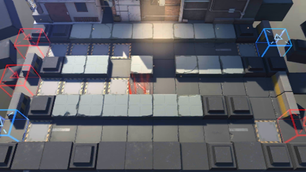

# 关卡一览————H6-2

## 关卡一览

关卡编号: H6-2

关卡名称: 冰狱行动-2

目标点生命值: 3

敌人总数: 36

理智消耗: 10

## 关卡地图

## 敌人情况

| 敌人图片 | 敌人名称 | 数量  |
|---------|-----|-----|
| ./eneIcons/eneIcons/¿ñ±©ËÞÖ÷Ê¿±ø.png| 狂暴宿主士兵  |   2  |
| ./eneIcons/eneIcons/¿ñ±©ËÞÖ÷ͶÖÀÊÖ.png| 狂暴宿主投掷手  |   4  |
| ./eneIcons/eneIcons/¿ñ±©ËÞÖ÷×鳤.png| 狂暴宿主组长  |   13  |
| ./eneIcons/eneIcons/ËÞÖ÷Á÷ÀËÕß.png| 宿主流浪者  |   8  |
| ./eneIcons/eneIcons/ËÞÖ÷Ê¿±ø×鳤.png| 宿主士兵组长  |   9  |
