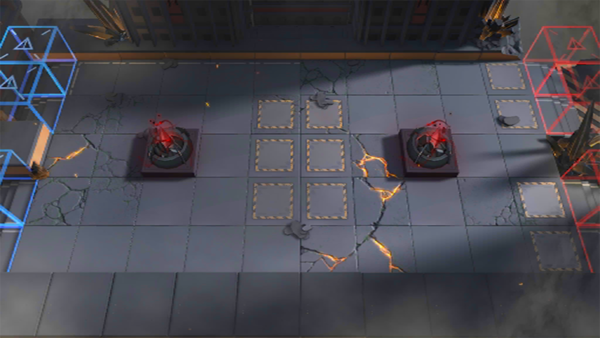

# 关卡一览————H7-1

## 关卡一览

关卡编号: H7-1

关卡名称: 星火行动-1

目标点生命值: 3

敌人总数: 66

理智消耗: 10

## 关卡地图

## 敌人情况

| 敌人图片 | 敌人名称 | 数量  |
|---------|-----|-----|
| ./eneIcons/eneIcons/Óλ÷¶Ó´«Áî±ø.png| 游击队传令兵  |   6  |
| ./eneIcons/eneIcons/Óλ÷¶Ó¶ÜÎÀ.png| 游击队盾卫  |   2  |
| ./eneIcons/eneIcons/Óλ÷¶Ó¾Ñ»÷ÊÖ.png| 游击队狙击手  |   8  |
| ./eneIcons/eneIcons/Óλ÷¶Ó¾Ñ»÷ÊÖ×鳤.png| 游击队狙击手组长  |   2  |
| ./eneIcons/eneIcons/Óλ÷¶ÓÆÈ»÷ÅÚ±ø.png| 游击队迫击炮兵  |   2  |
| ./eneIcons/eneIcons/Óλ÷¶ÓÈø¿¨×ÈÊõʦ.png| 游击队萨卡兹术师  |   2  |
| ./eneIcons/eneIcons/Óλ÷¶ÓÈø¿¨×ÈÊõʦ×鳤.png| 游击队萨卡兹术师组长  |   6  |
| ./eneIcons/eneIcons/Óλ÷¶ÓÈø¿¨×Èսʿ.png| 游击队萨卡兹战士  |   4  |
| ./eneIcons/eneIcons/Óλ÷¶ÓÈø¿¨×Èսʿ×鳤.png| 游击队萨卡兹战士组长  |   4  |
| ./eneIcons/eneIcons/Óλ÷¶ÓͻϮսʿ.png| 游击队突袭战士  |   6  |
| ./eneIcons/eneIcons/Óλ÷¶Óսʿ.png| 游击队战士  |   14  |
| ./eneIcons/eneIcons/Óλ÷¶Óսʿ×鳤.png| 游击队战士组长  |   10  |
