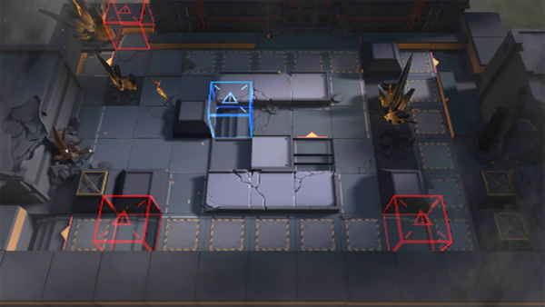

# 关卡一览————H7-2

## 关卡一览

关卡编号: H7-2

关卡名称: 星火行动-2

目标点生命值: 3

敌人总数: 65

理智消耗: 10

## 关卡地图

## 敌人情况

| 敌人图片 | 敌人名称 | 数量  |
|---------|-----|-----|
| ./eneIcons/eneIcons/¹¤ÒÏ×鳤.png| 工蚁组长  |   15  |
| ./eneIcons/eneIcons/Óλ÷¶Ó´«Áî±ø×鳤.png| 游击队传令兵组长  |   10  |
| ./eneIcons/eneIcons/Óλ÷¶Ó¶ÜÎÀ×鳤.png| 游击队盾卫组长  |   5  |
| ./eneIcons/eneIcons/Óλ÷¶Ó¾Ñ»÷ÊÖ×鳤.png| 游击队狙击手组长  |   6  |
| ./eneIcons/eneIcons/Óλ÷¶ÓÁÔÈ®pro.png| 游击队猎犬pro  |   9  |
| ./eneIcons/eneIcons/Óλ÷¶ÓÆÈ»÷ÅÚ±ø×鳤.png| 游击队迫击炮兵组长  |   3  |
| ./eneIcons/eneIcons/Óλ÷¶Óսʿ×鳤.png| 游击队战士组长  |   17  |
