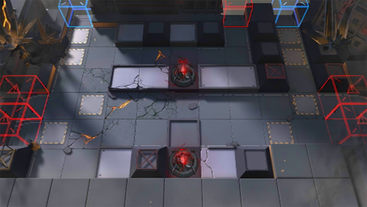

# 关卡一览————H7-3

## 关卡一览

关卡编号: H7-3

关卡名称: 星火行动-3

目标点生命值: 3

敌人总数: 50

理智消耗: 10

## 关卡地图

## 敌人情况

| 敌人图片 | 敌人名称 | 数量  |
|---------|-----|-----|
| ./eneIcons/eneIcons/Óλ÷¶Ó¶ÜÎÀ.png| 游击队盾卫  |   4  |
| ./eneIcons/eneIcons/Óλ÷¶Ó¶ÜÎÀ×鳤.png| 游击队盾卫组长  |   5  |
| ./eneIcons/eneIcons/Óλ÷¶ÓÁÔÈ®pro.png| 游击队猎犬pro  |   14  |
| ./eneIcons/eneIcons/Óλ÷¶ÓÈø¿¨×ÈÊõʦ×鳤.png| 游击队萨卡兹术师组长  |   6  |
| ./eneIcons/eneIcons/Óλ÷¶ÓÈø¿¨×Èսʿ×鳤.png| 游击队萨卡兹战士组长  |   13  |
| ./eneIcons/eneIcons/Óλ÷¶Óսʿ×鳤.png| 游击队战士组长  |   8  |
