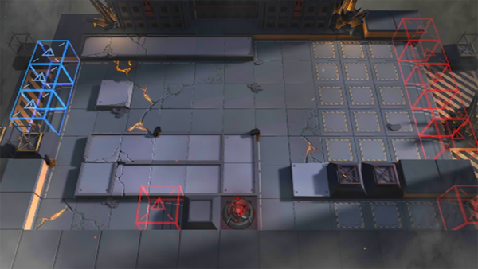

# 关卡一览————H7-4

## 关卡一览

关卡编号: H7-4

关卡名称: 星火行动-4

目标点生命值: 2

敌人总数: 96

理智消耗: 10

## 关卡地图

## 敌人情况

| 敌人图片 | 敌人名称 | 数量  |
|---------|-----|-----|
| ./eneIcons/eneIcons/°®¹úÕß.png| 爱国者  |   1  |
| ./eneIcons/eneIcons/Óλ÷¶Ó¶ÜÎÀ×鳤.png| 游击队盾卫组长  |   8  |
| ./eneIcons/eneIcons/Óλ÷¶Ó¾Ñ»÷ÊÖ×鳤.png| 游击队狙击手组长  |   11  |
| ./eneIcons/eneIcons/Óλ÷¶ÓÁÔÈ®.png| 游击队猎犬  |   20  |
| ./eneIcons/eneIcons/Óλ÷¶ÓÈø¿¨×Èսʿ×鳤.png| 游击队萨卡兹战士组长  |   6  |
| ./eneIcons/eneIcons/Óλ÷¶ÓͻϮսʿ×鳤.png| 游击队突袭战士组长  |   20  |
| ./eneIcons/eneIcons/Óλ÷¶Óսʿ.png| 游击队战士  |   6  |
| ./eneIcons/eneIcons/Óλ÷¶Óսʿ×鳤.png| 游击队战士组长  |   24  |
