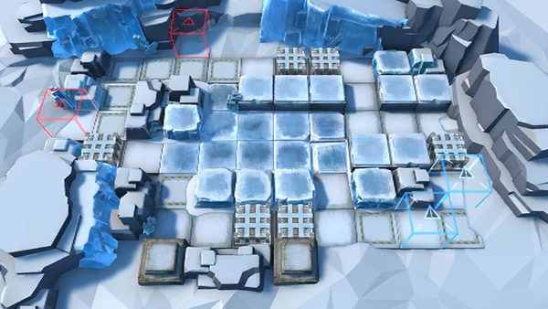

# 关卡一览————H8-1

## 关卡一览

关卡编号: H8-1

关卡名称: 狂夜行动-1

目标点生命值: 3

敌人总数: 43

理智消耗: 10

## 关卡地图

## 敌人情况

| 敌人图片 | 敌人名称 | 数量  |
|---------|-----|-----|
| ./eneIcons/eneIcons/µÛ¹úÇ°·æ°ÙÕ½¾«Èñ.png| 帝国前锋百战精锐  |   7  |
| ./eneIcons/eneIcons/¸ÐȾÕ߸߼¶¾À²ì¹Ù.png| 感染者高级纠察官  |   16  |
| ./eneIcons/eneIcons/¸ÐȾÕß¾À²ì¹Ù.png| 感染者纠察官  |   6  |
| ./eneIcons/eneIcons/ÎÚÈø˹¸ß¼¶×ÅîøÊõʦ.png| 乌萨斯高级着铠术师  |   10  |
| ./eneIcons/eneIcons/ÎÚÈø˹ƽÃñ.png| 乌萨斯平民  |   4  |
