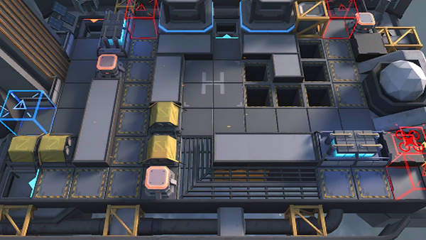

# 关卡一览————H8-2

## 关卡一览

关卡编号: H8-2

关卡名称: 狂夜行动-2

目标点生命值: 3

敌人总数: 31

理智消耗: 10

## 关卡地图

## 敌人情况

| 敌人图片 | 敌人名称 | 数量  |
|---------|-----|-----|
| ./eneIcons/eneIcons/µÛ¹úÅÚ»ðÖÐÊàÏÈÕ×Õß.png| 帝国炮火中枢先兆者  |   1  |
| ./eneIcons/eneIcons/µÛ¹úÇ°·æ°ÙÕ½¾«Èñ.png| 帝国前锋百战精锐  |   3  |
| ./eneIcons/eneIcons/Ëþ¶À­.png| 塔露拉  |   1  |
| ./eneIcons/eneIcons/ÎÚÈø˹ÁÑÊÞ×åĸ.png| 乌萨斯裂兽族母  |   18  |
| ./eneIcons/eneIcons/ÎÚÈø˹ͻ»÷¶Ó¶Ó³¤.png| 乌萨斯突击队队长  |   8  |
