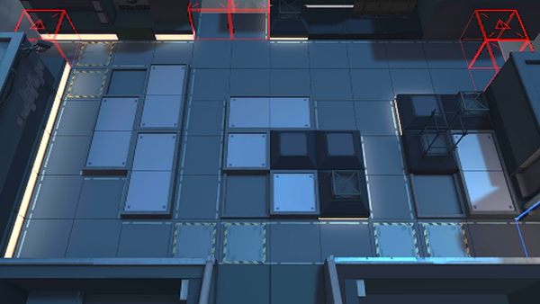

# 关卡一览————H8-3

## 关卡一览

关卡编号: H8-3

关卡名称: 狂夜行动-3

目标点生命值: 3

敌人总数: 63

理智消耗: 10

## 关卡地图

## 敌人情况

| 敌人图片 | 敌人名称 | 数量  |
|---------|-----|-----|
| ./eneIcons/eneIcons/·ÛËé¹¥¼á×鳤.png| 粉碎攻坚组长  |   1  |
| ./eneIcons/eneIcons/¿ñ±©ËÞÖ÷Ê¿±ø.png| 狂暴宿主士兵  |   3  |
| ./eneIcons/eneIcons/¿ñ±©ËÞÖ÷×鳤.png| 狂暴宿主组长  |   1  |
| ./eneIcons/eneIcons/÷·Æ˹ÌØ£¬¡°¸èÕß¡±.png| 梅菲斯特，“歌者”  |   1  |
| ./eneIcons/eneIcons/Èø¿¨×ÈËÞÖ÷ÎÀ³²°Ù·ò³¤.png| 萨卡兹宿主卫巢百夫长  |   1  |
| ./eneIcons/eneIcons/ËÞÖ÷Á÷ÀËÕß.png| 宿主流浪者  |   24  |
| ./eneIcons/eneIcons/ËÞÖ÷Ê¿±ø×鳤.png| 宿主士兵组长  |   30  |
| ./eneIcons/eneIcons/ËÞÖ÷ÖØ×°×鳤.png| 宿主重装组长  |   2  |
