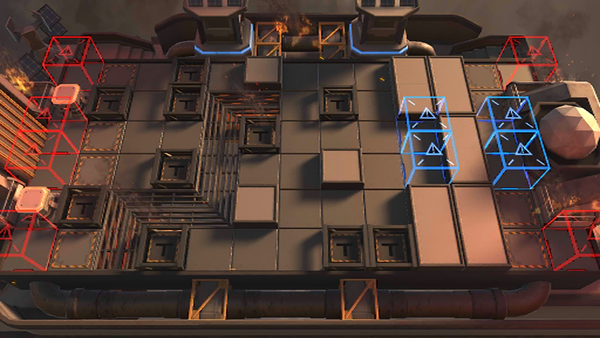

# 关卡一览————H8-4

## 关卡一览

关卡编号: H8-4

关卡名称: 狂夜行动-4

目标点生命值: 2

敌人总数: 51

理智消耗: 10

## 关卡地图

## 敌人情况

| 敌人图片 | 敌人名称 | 数量  |
|---------|-----|-----|
| ./eneIcons/eneIcons/²»ËÀµÄºÚÉß.png| 不死的黑蛇  |   1  |
| ./eneIcons/eneIcons/µÛ¹úÅÚ»ðÖÐÊàÏÈÕ×Õß.png| 帝国炮火中枢先兆者  |   2  |
| ./eneIcons/eneIcons/¸ÐȾÕ߸߼¶¾À²ì¹Ù.png| 感染者高级纠察官  |   13  |
| ./eneIcons/eneIcons/ÎÚÈø˹¸ß¼¶×ÅîøÊõʦ.png| 乌萨斯高级着铠术师  |   7  |
| ./eneIcons/eneIcons/ÎÚÈø˹ÁÑÊÞ×åĸ.png| 乌萨斯裂兽族母  |   16  |
| ./eneIcons/eneIcons/ÎÚÈø˹ƽÃñ.png| 乌萨斯平民  |   12  |
