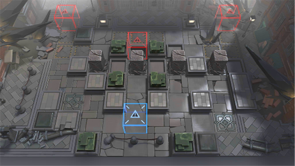

# 关卡一览————H9-2

## 关卡一览

关卡编号: H9-2

关卡名称: 暴风行动-2

目标点生命值: 3

敌人总数: 50

理智消耗: 10

## 关卡地图

## 敌人情况

| 敌人图片 | 敌人名称 | 数量  |
|---------|-----|-----|
| ./eneIcons/eneIcons/Éî³Ø°µÓ°Êõʦ¶Ó³¤.png| 深池暗影术师队长  |   4  |
| ./eneIcons/eneIcons/Éî³Ø·Ù»ÙÕ߶ӳ¤.png| 深池焚毁者队长  |   7  |
| ./eneIcons/eneIcons/Éî³ØËÜÄÜÊõʦ¶Ó³¤.png| 深池塑能术师队长  |   6  |
| ./eneIcons/eneIcons/Éî³ØÕì²ìÈ®pro.png| 深池侦察犬pro  |   27  |
| ./eneIcons/eneIcons/Éî³ØÖؼ×ÎÀÊ¿¶Ó³¤.png| 深池重甲卫士队长  |   6  |
