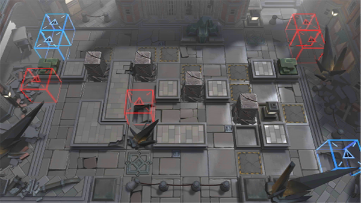

# 关卡一览————H9-6

## 关卡一览

关卡编号: H9-6

关卡名称: 急雨行动-3

目标点生命值: 2

敌人总数: 121

理智消耗: 10

## 关卡地图

## 敌人情况

| 敌人图片 | 敌人名称 | 数量  |
|---------|-----|-----|
| ./eneIcons/eneIcons/·ßÅ­µÄÊØĹʯÏñ.png| 愤怒的守墓石像  |   6  |
| ./eneIcons/eneIcons/ÂûµÂÀ­.png| 蔓德拉  |   1  |
| ./eneIcons/eneIcons/Éî³Ø°µÓ°Êõʦ¶Ó³¤.png| 深池暗影术师队长  |   6  |
| ./eneIcons/eneIcons/Éî³Ø·½ÕóÖ¸»Ó¹Ù.png| 深池方阵指挥官  |   32  |
| ./eneIcons/eneIcons/Éî³Ø·ÉÐдó¶Ó¶Ó³¤.png| 深池飞行大队队长  |   16  |
| ./eneIcons/eneIcons/Éî³Ø·Ù»ÙÕ߶ӳ¤.png| 深池焚毁者队长  |   6  |
| ./eneIcons/eneIcons/Éî³Ø»ïÓÑÎÀ¶Ó¾«Ó¢.png| 深池伙友卫队精英  |   4  |
| ./eneIcons/eneIcons/Éî³Ø»ïÓÑÓ°Èо«Ó¢.png| 深池伙友影刃精英  |   7  |
| ./eneIcons/eneIcons/Éî³Ø¾Ñ»÷¶Ó³¤.png| 深池狙击队长  |   3  |
| ./eneIcons/eneIcons/Éî³ØËÜÄÜÊõʦ¶Ó³¤.png| 深池塑能术师队长  |   3  |
| ./eneIcons/eneIcons/Éî³ØÕì²ì¶Ó³¤.png| 深池侦察队长  |   18  |
| ./eneIcons/eneIcons/Éî³ØÕì²ìÈ®pro.png| 深池侦察犬pro  |   6  |
| ./eneIcons/eneIcons/Éî³ØÖؼ×ÎÀÊ¿¶Ó³¤.png| 深池重甲卫士队长  |   13  |
