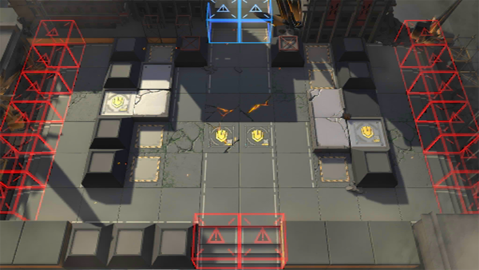

# 关卡一览————ISW-DF_险路勿近

## 关卡一览

关卡编号: ISW-DF_险路勿近

关卡名称: 险路勿近

目标点生命值: 100

敌人总数: 53

理智消耗: 0

## 关卡地图

## 敌人情况

| 敌人图片 | 敌人名称 | 数量  |
|---------|-----|-----|
| ./eneIcons/eneIcons/¡°Ä¹±®¡±.png| “墓碑”  |   1  |
| ./eneIcons/eneIcons/åóÊÖ×鳤.png| 弩手组长  |   12  |
| ./eneIcons/eneIcons/Çá¼×ÎÀ±ø×鳤.png| 轻甲卫兵组长  |   12  |
| ./eneIcons/eneIcons/Èø¿¨×È´©´ÌÊÖ×鳤.png| 萨卡兹穿刺手组长  |   4  |
| ./eneIcons/eneIcons/Èø¿¨×È´ó½£ÊÖ.png| 萨卡兹大剑手  |   4  |
| ./eneIcons/eneIcons/Ê¿±ø.png| 士兵  |   22  |
